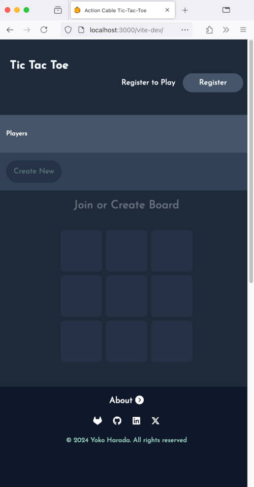
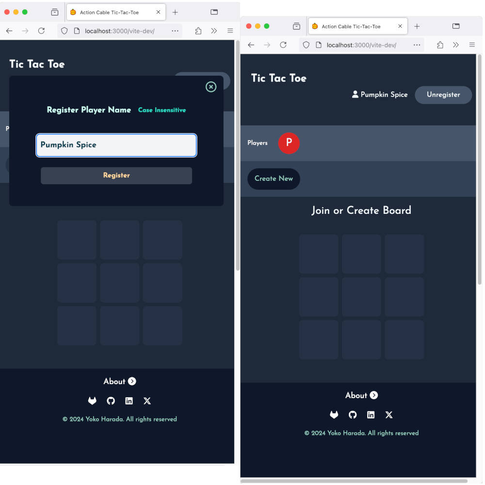
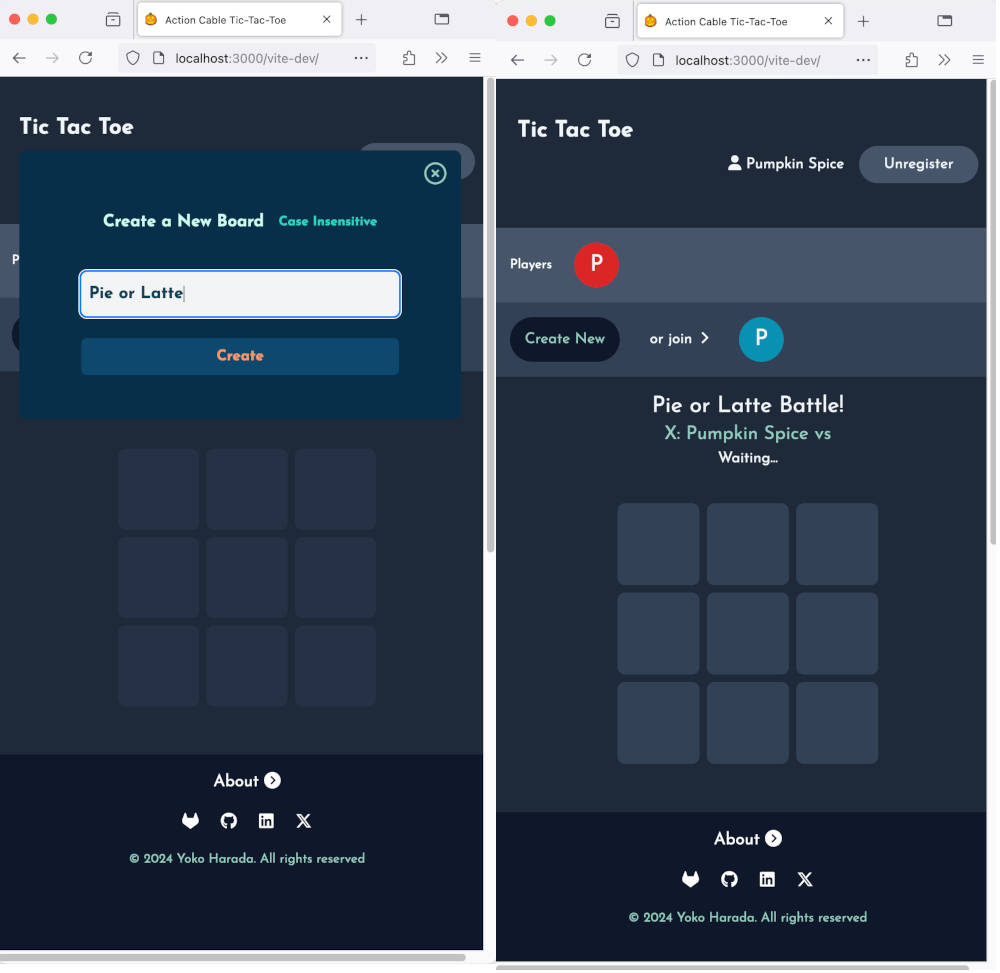
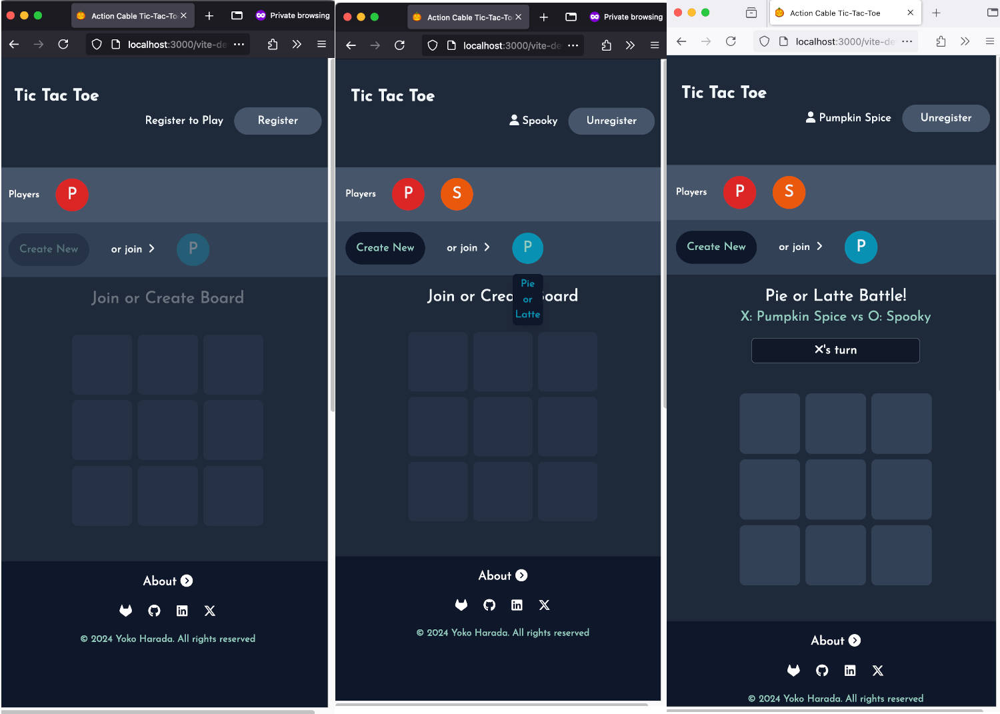
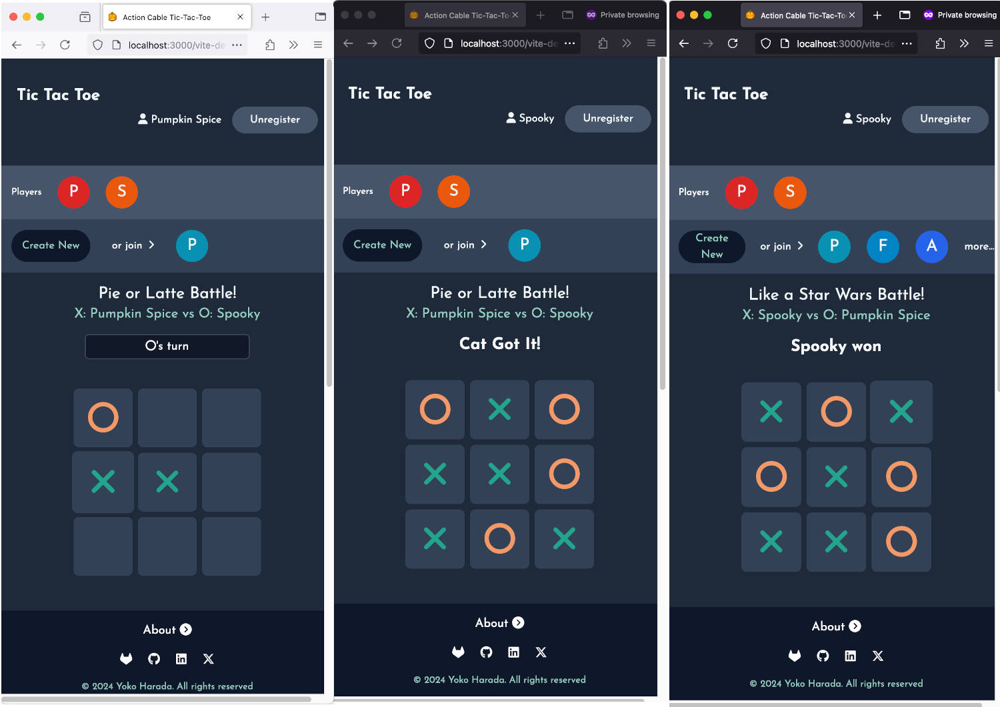
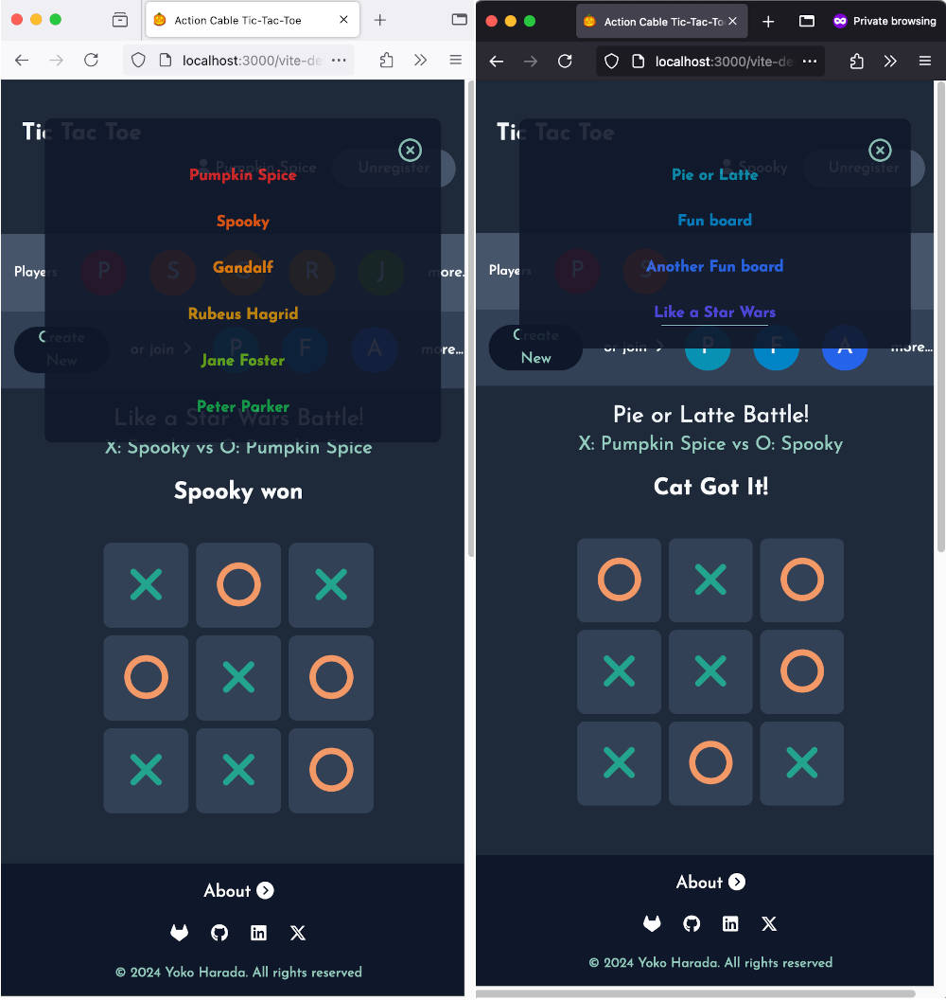
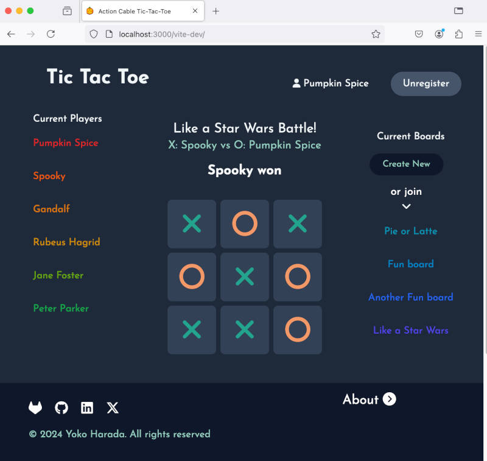

# Multi-player, Multi-board Tic Tac Toe by Action Cable

This is a Ruby on Rails, Action Cable (WebSocket) example application.
Players can create multiple boards after registering their player names.
The players can join multiple boards created by other players.
When a player is registered, the player name instantly appears on all players' screen.
When a board is created, the board name instantly appears on all players' screen as well.

If a player creates a board, that player takes X (the first player).
If a player joins to the existing board as the second player, that player takes O. 
If a player joins the board as the third or later player, that player will be a viewer of that board.
A game progress is instantly reflected to all players' screen including viewers.

## How to Run the App

### Pre-requisite
- Ruby: used version 3.3.5
- Bun: used version 1.1.29

### Code

Clone the repo or download the code from:

[https://gitlab.com/yokolet/action-cable-tictactoe](https://gitlab.com/yokolet/action-cable-tictactoe)

### Installation

```bash
$ bundle install
$ bun install
```

### Run app

#### Development mode

```bash
$ bin/dev
```

#### Production mode
- Edit `config/environments/production.rb` to set false `config.force_ssl = false`

```bash
$ RAILS_ENV=production rails assets:precompile
$ RAILS_ENV=production rails s
```

Depends on a browser, connection to http://localhost:3000 might be redirected to SSL. In such a case, use another browser.
Chrome, Firefox, and Safari don't have a problem to request non-SSL URL.

### Run test

```bash
$ bundle exec rspec
```

### Deploy to Heroku

#### Set up buildpacks

Go to the application settings page on Heroku website and add two buildpacks.
The two buildpacks should have the order below:
1. https://github.com/jakeg/heroku-buildpack-bun
2. heroku/ruby

Verify the added buildpacks using Heroku CLI
```bash
$ heroku buildpacks
=== action-cable-tictactoe Buildpack URLs

1. https://github.com/jakeg/heroku-buildpack-bun
2. heroku/ruby
```

#### Create Procfile

Create a Procfile in the top directory with the content below:

```bash
web: bin/rails server
```

#### Manual deployment

Run the Heroku CLI command below to deploy manually.

```bash
$ git push heroku main

# or below to deploy a branch

$ git push heroku branch-name:main
```

## How to Use

#### 1. Initial screen

An initial screen is like this. Only one clickable is the "Register" button.



#### 2. Register player name

The first thing to do is to register a player name. The registration is done by just a name, no password.
The name is case insensitive, maximum 30 characters. Only alphabet, number, single quote, hyphen, and underscore
are available to use. The maximum number of players is limited to 20.
Once the registration is done successfully, the player name appears in the player list section. In the small screen,
hover over the initial. The full player name can been seen.



#### 3. Create a board

The registered player can create a board or join if there are boards already.
Just like a player name, a board name is case insensitive, maximum 30 characters. Only alphabet, number, 
single quote, hyphen, and underscore are available to use. The maximum number of boards is limited to 20.

Once the board is created successfully, the board name appears in the board list section. In the small screen,
hover over the initial. The full board name can been seen.
At the same time, board's initial state shows up. The board creator takes X (the first player), and is awaiting an
opponent to join the board.



#### 4. Another player's registration followed by joining the board

Open another browser or private window to visit the page. Before registration, people can see registered players
and created boards.
When the second player registers, the name instantly appears on the first player's screen as wll.
If the second player clicks the existing board, that person takes O (the second player). Then, the game starts.
If the player clicks the existing board whose game is going on already, the player becomes a viewer.



#### 5. Game progress and result

While the game is ongoing, X or O's turn is displayed. The game progress is reflected on players' screen immediately.
If a viewer is watching the game, the progress is also reflected on the viewer's screen immediately.
When the game finishes, the result is shown up -- "Cat got it" for draw, player's name for X or O's win.



#### 6. More players, more boards

On a small screen, sometime, the screen width is not enough for all players and board names. In such a case,
"more..." buttons show up. Click "more..." to see all names.



#### 7. Bigger Window View

If the window size is big enough, panels are arranged from left to right.



#### 8. Multiple games at the same time

Players can create multiple boards and play multiple games at the same time. Clicking the board name switches the board.
Check the player names, A vs B, to see who are playing on that board.

#### 9. Deletion of players and boards

Players will be deleted when "Unregister" button is clicked or close a tab or window.
On the other hand, boards expire after certain length of inactivity.
Both players and boards expire 10 minutes after the creation.
Expired states are not reflected on the screen in time.


## Live Site

The application is live at Heroku.

[https://action-cable-tictactoe-2fbbd874419e.herokuapp.com/](https://action-cable-tictactoe-2fbbd874419e.herokuapp.com/)
